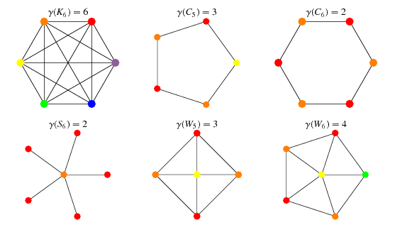
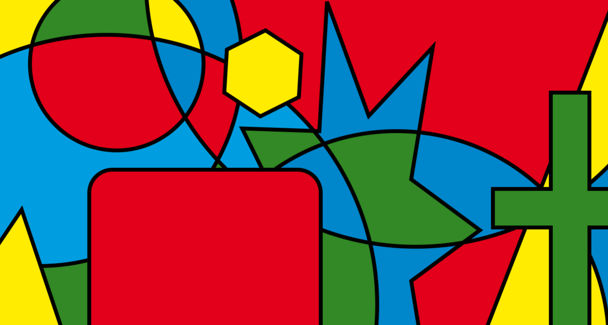

<h1 align="center">Graph Coloring</h1>

## Description

Assing colors to nodes of a graph so that no two adjacent nodes recieve the same color.

## Optimal number of colors

The number of optimal colors (minimun colors needed) is the number of nodes of the biggest complete subgraph (aka [Clique](https://en.wikipedia.org/wiki/Clique_(graph_theory)), this known as the [Clique_problem](https://en.wikipedia.org/wiki/Clique_problem) or [Chromatic Number](https://mathworld.wolfram.com/ChromaticNumber.html)

> ### Clique or Complete subgraph
> When are the nodes are adjacent to each other.

# Local Search Approach

### Combined objective function

- **Feasibility objective func**: Reduce the number of bad edges (edges with nodes of the same color).
- **Optimization objective func**: Augment the same color -> sum(square(number_nodes_same_color))

Minimize: Feasibility & Optimization

## Special Case: Map coloring (4 color theorem)

Color a map so that no two adjacent territories recieve the same color. The maximun colors needed are 4 because of the [4 Color Theorem](https://en.wikipedia.org/wiki/Four_color_theorem):
- Every map can be colores with just 4 colors
- Proven by Kenneth Appel and Wolfgang Haken
- First major theroem proven with a computer

## Resoruces

- [Wikipedia: Graph Coloring](https://en.wikipedia.org/wiki/Graph_coloring)
- [Wikipedia: Map Coloring](https://en.wikipedia.org/wiki/Map_coloring)
- [Wikipedia: Four Color Theorem](https://en.wikipedia.org/wiki/Four_color_theorem)
