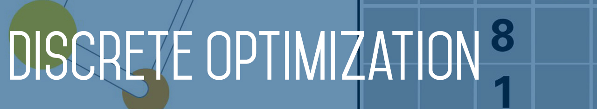
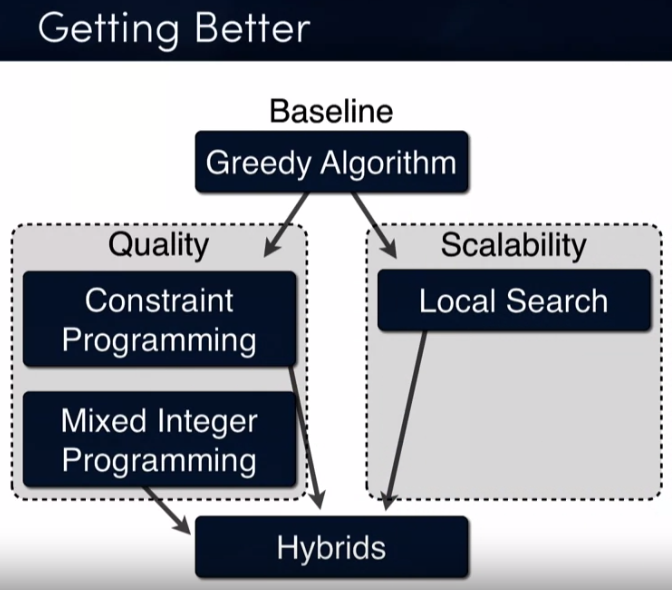
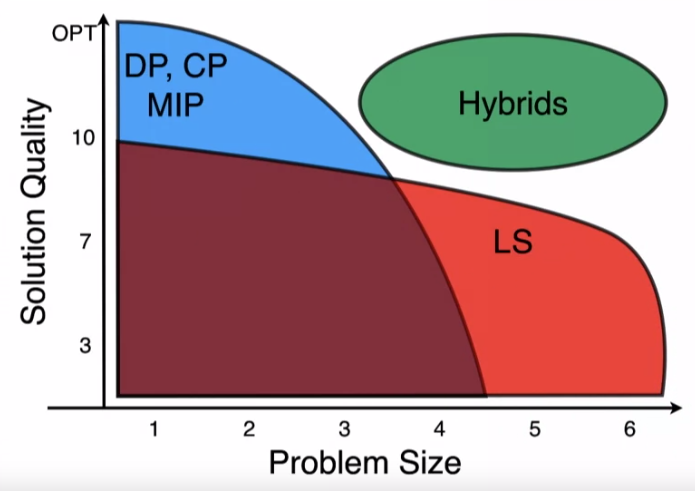

`Analítica prescriptiva` / `Investigación operativa` / `Optimización combinatoria` / `Programación entera`

> ### *Mediante la analítica prescriptiva se consiguen recomendaciones sobre las acciones que se han de seguir para reducir costes o mejorar los beneficios.*

# Optimization paradigms
1. Greedy: Solución a mano
2. Global techinques: Techniques that are guaranteed to find the optimal solution if you give the enough time.
   - Dynamic Programming (**DP**) (backtracking, branch & bound)
   - Constraint Programming (**CP**)
   - Linear Programming (**LP**)
     - Programación lineal continua: Simplex
     - Programación lineal entera (discreta): Simplex Lineal Entero
   - Mixed Integer Programming (**MIP**)
3. Local Search (**LS**): Scale very well with problems of large size (may not give you the best solution).
4. Hybrids: Combina lo mejor de Global y Local.

| Tecnicas           | Puntos Fuertes               |
|--------------------|------------------------------|
|  |  |

### Visualize everithing

- CP: How much it prunes?
- LS: What are the sequence of solutions? How fast it goes down?
- LP, MIP: What is the relaxation? how good is it?

# Greedy

### Greedy solutions for common problems
- **Travelling Salesman Problem**: At each step of the journey, visit the nearest unvisited city.
- **Knapsack**: Sort items in decreasing order of value per weight (V/W), then insert them into the sack in that order until there is no space.

# Mixed Integer Programming (MIP)
- Continuous math
- Linear algebra

---

> ### Un problema NP-Completo cumple
> - Es muy rápido de checkear si la solucion propuesta es correcta.
> - Si sabes resolver un problema NP-Completo, sabes resolverlos todos.
> - Existe el mito de que se resuelven con coste exponencial.

# Ejemplos

> - **Feasibily Problems**: Any solution meeting all the criteria is acceptable.
> - **Optimization Problems**: Find the best solution that satisfies the criteria.

### Feasibily Problems

> **DP**=Dynamic Programming, **CP**=Constraint Programming, **MIP**=Mixed Integer Programming

| Problem                                               | My solution | OR Tools Doc                                                |
|-------------------------------------------------------|:-----------:|:-----------------------------------------------------------:|
| [Cryptarithmetic](problems/Cryptarithmetic)           | CP          | [doc](https://developers.google.com/optimization/cp/cryptarithmetic) |
| [N queens](problems/N%20Queens)                       | CP          | [doc](https://developers.google.com/optimization/cp/queens) |
| [Sudoku](problems/Sudoku)                             | DP, CP      |                                                             |
| [Graph Coloring](problems/Graph%20Coloring)           | CP          |                                                             |
| [Employee Scheduling](problems/Employee%20Scheduling) | CP          | [doc](https://developers.google.com/optimization/scheduling/employee_scheduling) |
| [The Job Shop](problems/Job%20Shop)                   | CP          | [doc](https://developers.google.com/optimization/scheduling/job_shop) |

### Optimization Problems
- Knapsack (Problema de la mochila)
- Optimización de rutas
  - Pickup & delivery
    - Datos: Puntos en el mapa de regida, puntos de entrega, tiempo max de mercancía en camión
  - Dijkstra shortest path (Google Map calcular ruta)
  - Problema del viajante de comercio
- Relajación Lagrangeana (empresa eléctrica, arrancar o parar una central térmica)
- Constraint programming
  - Turnos de Madrid
  - problema de asignación de turnos
  - Procesos de aprovisonamiento, inventario...
  - Cuánto envío del almacén a la tienda

### Optimization Problems approach

1. Traducir el problema de negocio a un problema de optimización
   Identificar Variables de decisión.
   - Hora que empieza.
   - Hora que acaba.
   - Tarea que hace en el minuto 3
   - Tarea que hace en el minuto 4

2. Normalemete se acaban con muchas soluciones que igualan la mejor función objetivo
   - Recomendable: Añadir funciones objetivo secundarias hasta que queden pocas soluciones e idelamente una unica solucion. Ejemplo de turnos

   Funcion pricipal: Encajar horarios
   Fucion Scundaria: Que esten más contentos con su horario

## References

- https://www.coursera.org/learn/discrete-optimization
- https://www.coursera.org/learn/delivery-problem
- https://www.gestiondeoperaciones.net
- https://medium.com/@AlainChabrier/scheduling-with-constraint-programming-35a23839e25c

## Competitions

- Kaggle Santa 🎅🏻
  - [Traveling Santa Problem](https://www.kaggle.com/c/traveling-santa-problem) 2012 (Traveling Santa Problem)
  - [Helping Santa's Helpers](https://www.kaggle.com/c/helping-santas-helpers) 2014 (Job Scheduling problem)
  - [Santa's Stolen Sleigh](https://www.kaggle.com/c/santas-stolen-sleigh) 2015 (Routing)
  - [Santa's Uncertain Bags](https://www.kaggle.com/c/santas-uncertain-bags) 2016
  - [Santa Gift Matching Challenge](https://www.kaggle.com/c/santa-gift-matching) 2017
  - [Traveling Santa 2018: Prime Paths](https://www.kaggle.com/c/traveling-santa-2018-prime-paths) 2018
  - [Santa 2019: Revenge of the Accountants](https://www.kaggle.com/c/santa-2019-revenge-of-the-accountants) 2019
  - [Santa's Workshop Tour 2019](https://www.kaggle.com/c/santa-workshop-tour-2019) 2019
- Hash Code
  - [Hash Code Kaggle Archive: Drone Delivery](https://www.kaggle.com/c/hashcode-drone-delivery): Can you help coordinate the drone delivery supply chain?
  - [Hash Code Kaggle Archive: Photo Slideshow Optimization](https://www.kaggle.com/c/hashcode-photo-slideshow): Optimizing a photo album from Hash Code 2019
- ROADEF: Bastante complicada.
  - [ROADEF 2020](https://www.roadef.org/challenge/2020)
  - [ROADEF 2018](https://www.roadef.org/challenge/2018)
  
  
## Libraries
  
#### Constraint Programming Solvers

> #### Nota de Javier Lafuente
> Para Constraint Programming sin dudarlo **Choco Solver**.

| Library            | Languaje                         | Price                      |
|--------------------|:--------------------------------:|----------------------------|
| OR-Tools (Google)  | C++ (APIs: Java, Python, & .NET) | Open Source                |
| CHOCO              | Java                             | Open Source                |
| JACOP              | Java                             | Open Source                |
| Gecode             | C++                              | Free                       |
| ILog               | Binary                           | Free with academic license |
| MiniZinc / G12     | Binary                           | Free for students          |

#### Mixed Integer Programming Solvers

> #### Nota de Javier Lafuente
> Para Mixed Integer Programming no hay nada open source y bueno. Pero CPLEX, de IBM, tiene una versión community limitada por tamaño de problema.

| Library            | Languaje  | Price                      |
|--------------------|:---------:|----------------------------|
| GLPK               | C         | Open Source                |
| LPSolve            | C         | Open Source                |
| BCP                | C++       | Open Source                |
| CBC                | C++       | Open Source                |
| CPLEX (IBM)        | Binary    | Free with academic license |
| Gurobi             | Binary    | Free with academic license |
| SCIP               | Binary    | Free for academic use      |

#### Linear Programming Solvers

> #### Revisar [PuLP](https://github.com/coin-or/pulp)

| Library            | Languaje  | Price                      |
|--------------------|:---------:|----------------------------|
| CLP                | C++       | Open Source                |
| SimplexSolver      | Java      | Open Source                |

#### Local Search Solvers

> #### Nota de Javier Lafuente
> Para Local Search **Optaplanner**.

| Library            | Languaje  | Price                      |
|--------------------|:---------:|----------------------------|
| OptaPlanner        | Java      | Open Source                |
| Local Solver       | Binary    | Free with academic license |

#### SAT Solvers

| Library            | Languaje  | Price                      |
|--------------------|:---------:|----------------------------|
| cryptominisat      | C++       | Open Source                |
| Glucose            | C         | Open Source                |
| Lingeling          | C         | Open Source                |
| UBCSAT             | C         | Open Source                |
| MiniSat            | Binary    | Free                       |

#### Hybrid Solvers

| Library            | Languaje  | Price                      |
|--------------------|:---------:|----------------------------|
| SCIP               | Binary    | Free for academic use      |
